# terraform-aws-sns-sqs

Production-ready Terraform module for AWS SNS topics and SQS queues. Manages topics, queues, subscriptions, dead-letter queues, FIFO support, message filtering, KMS encryption, access policies, and CloudWatch alarms.

## Architecture

```mermaid
flowchart TD
    A[Terraform Module] --> B[SNS Topics]
    A --> C[SQS Queues]
    A --> D[Dead-Letter Queues]
    A --> E[SNS Subscriptions]
    A --> F[Queue Policies]
    A --> G[CloudWatch Alarms]

    B --> B1[Standard Topics]
    B --> B2[FIFO Topics]
    B --> B3[KMS Encryption]
    B --> B4[Delivery Policy]
    C --> C1[Standard Queues]
    C --> C2[FIFO Queues]
    C --> C3[KMS Encryption]
    C --> C4[Redrive Policy]
    C --> C5[Long Polling]
    D --> D1[Message Retention]
    D --> D2[Encrypted DLQ]
    E --> E1[SQS Protocol]
    E --> E2[HTTPS Protocol]
    E --> E3[Email Protocol]
    E --> E4[Message Filtering]
    E --> E5[Raw Delivery]
    G --> G1[Queue Depth Alarm]
    G --> G2[DLQ Depth Alarm]
    G --> G3[Message Age Alarm]

    style A fill:#FF9900,stroke:#E88B00,color:#fff
    style B fill:#D63AFF,stroke:#B833DB,color:#fff
    style C fill:#3F8624,stroke:#2E6B1A,color:#fff
    style D fill:#E74C3C,stroke:#C0392B,color:#fff
    style E fill:#2980B9,stroke:#1F6DA0,color:#fff
    style F fill:#F39C12,stroke:#D98E0A,color:#333
    style G fill:#1ABC9C,stroke:#16A085,color:#fff
    style B1 fill:#E8B4FF,stroke:#D9A0F0,color:#333
    style B2 fill:#E8B4FF,stroke:#D9A0F0,color:#333
    style B3 fill:#E8B4FF,stroke:#D9A0F0,color:#333
    style B4 fill:#E8B4FF,stroke:#D9A0F0,color:#333
    style C1 fill:#7DCD6B,stroke:#6BBF5A,color:#333
    style C2 fill:#7DCD6B,stroke:#6BBF5A,color:#333
    style C3 fill:#7DCD6B,stroke:#6BBF5A,color:#333
    style C4 fill:#7DCD6B,stroke:#6BBF5A,color:#333
    style C5 fill:#7DCD6B,stroke:#6BBF5A,color:#333
    style D1 fill:#F1948A,stroke:#EC7063,color:#333
    style D2 fill:#F1948A,stroke:#EC7063,color:#333
    style E1 fill:#7FB3D8,stroke:#6CA0C5,color:#333
    style E2 fill:#7FB3D8,stroke:#6CA0C5,color:#333
    style E3 fill:#7FB3D8,stroke:#6CA0C5,color:#333
    style E4 fill:#7FB3D8,stroke:#6CA0C5,color:#333
    style E5 fill:#7FB3D8,stroke:#6CA0C5,color:#333
    style G1 fill:#76D7C4,stroke:#63C8B5,color:#333
    style G2 fill:#76D7C4,stroke:#63C8B5,color:#333
    style G3 fill:#76D7C4,stroke:#63C8B5,color:#333
```



## Usage

```hcl
module "messaging" {
  source = "path/to/terraform-aws-sns-sqs"

  sns_topics = {
    "order-notifications" = {
      display_name = "Order Notifications"
    }
  }

  sqs_queues = {
    "order-processor" = {
      visibility_timeout_seconds = 60
    }
  }

  sns_subscriptions = {
    "orders-to-processor" = {
      topic_arn = module.messaging.sns_topic_arns["order-notifications"]
      protocol  = "sqs"
      endpoint  = module.messaging.sqs_queue_arns["order-processor"]
    }
  }
}
```

## Features

- SNS topic creation (standard and FIFO) with KMS encryption
- SQS queue creation (standard and FIFO) with comprehensive configuration
- Dead-letter queue management with configurable retention
- SNS-to-SQS subscriptions with raw message delivery
- Message filtering policies (attribute-based and body-based)
- KMS encryption for both topics and queues
- SQS queue access policies for SNS publish permissions
- Redrive policies for automatic DLQ routing
- FIFO support with deduplication and per-message-group throughput
- Long polling configuration for SQS queues
- CloudWatch alarms for queue depth, DLQ depth, and message age
- HTTP/S, email, Lambda, and Firehose subscription protocols

## Requirements

| Name | Version |
|------|---------|
| terraform | >= 1.3.0 |
| aws | >= 5.0 |

## Inputs

| Name | Description | Type | Required |
|------|-------------|------|----------|
| tags | Common tags for all resources | `map(string)` | no |
| sns_topics | Map of SNS topics to create | `map(object)` | no |
| sqs_queues | Map of SQS queues to create | `map(object)` | no |
| dead_letter_queues | Map of dead-letter queues | `map(object)` | no |
| sns_subscriptions | Map of SNS subscriptions | `map(object)` | no |
| sqs_sns_policies | SQS queue policies for SNS access | `map(object)` | no |
| cloudwatch_alarms | CloudWatch alarm configuration | `object` | no |

## Outputs

| Name | Description |
|------|-------------|
| sns_topic_arns | Map of topic names to ARNs |
| sns_topic_ids | Map of topic names to IDs |
| sns_topic_names | Map of topic logical names to actual names |
| sqs_queue_arns | Map of queue names to ARNs |
| sqs_queue_ids | Map of queue names to IDs |
| sqs_queue_urls | Map of queue names to URLs |
| dlq_arns | Map of DLQ names to ARNs |
| dlq_urls | Map of DLQ names to URLs |
| sns_subscription_arns | Map of subscription names to ARNs |
| account_id | AWS account ID |
| region | AWS region |

## Examples

- [Basic](examples/basic/) - Simple SNS topic with SQS subscription
- [Advanced](examples/advanced/) - FIFO, DLQ, KMS encryption, message filtering
- [Complete](examples/complete/) - All features with CloudWatch alarms and multiple protocols

## License

MIT License - see [LICENSE](LICENSE) for details.
